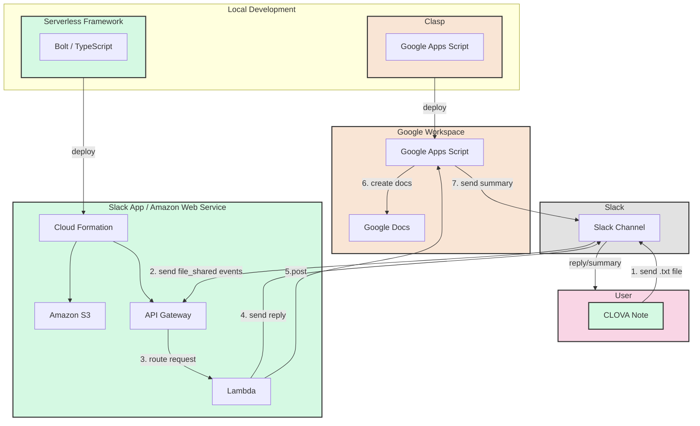

# Slack Meeting Summary Bot（サンプルリポジトリ）


## AWS
Slack botをServerless Frameworkを使ってデプロイ。
時間のかかるOpenAIの処理はLambda上で処理せず、Google Apps Scriptに委譲している。

- Slackからのイベント受け取り
- Google Apps ScriptへのPOST


## Google Apps Script
Webアプリとしてデプロイ。

- OpenAI APIを使って要約
- Slack投稿

# Setup
## Slack
アプリの設定。

- アプリの作成
  - https://api.slack.com/apps
- Event Subscriptionsの設定
  - AWSにデプロイしたURLをRequest　URLに設定。
  - bot eventsを設定
 
|  |  |
|:-:|:-:|
|||

- App Homeの設定
  - App Display Name等を設定 
  - Show Tabsから、*Allow users to send Slash commands and messages from the messages tab*を有効化。


- OAuth & Permissionsの設定
  - Bot Token Scopesを設定
    - channels:read / channels:history / chat:write / files:read  

- Workspaceへのインストール
  - Install Appからインストール
  - **Bot User OAuth Token**を取得

- Basic Information > App Credentialsから**Signing Secret**を取得

## Google Apps Script
OpenAI APIにアクセスする処理を担う。

- Google Apps Scriptを作成。
- `appsscript.json`に作成したScript IDを指定
- スクリプトプロパティに下記を指定
  - OPENAI_API_KEY
  - SLACK_BOT_TOKEN
    - Bot User OAuth Token
  - ERROR_MAIL_ADDRESS 
- `clasp push`
- `clasp deploy`
  - Webアプリとしてデプロイ。デプロイしたURLはSlack Appの環境変数に指定する。

## Slack App（AWS）
- IAMの設定
  - Serverless Frameworkを用いたデプロイで必要 
    - S3
    - IAM
    - Lambda
    - API Gateway
    - Cloudwatch Logs
    - Cloud Formation

>**Note**
>
>https://zenn.dev/peg/articles/93d844f6dd11c9

- aws cliのconfigyre
- Slack Appの`.env`の設定
```.env
SLACK_BOT_TOKEN=<xoxb-...>
SLACK_SIGNING_SECRET=<Your Secret>
GAS_API_URL=https://script.google.com/macros/s/<Script ID>/exec
```

デプロイ方法は以下。
```
serverless deploy
```

環境は、`--stage prod`など`--stage`フラグで分けられる。

# Usage
- Clova Noteで録音・文字起こし
- 文字起こしを修正
  - 参加者名の入力など
- 右上のメニューから「音声記録のダウンロード」
- Slackで共有。アプリをインストールしたチャンネルに投稿

|  |  |
|:-:|:-:|
|||

- しばらくすると要約が送信されます。
